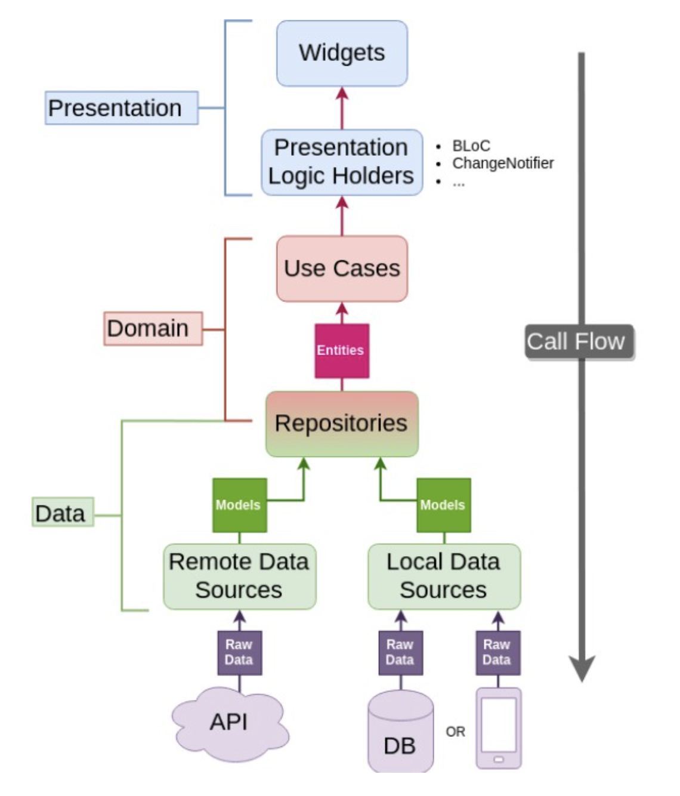

# NEWS-App 

### Overview :
A News App built with Flutter and implemented **clean architecture**. In this app, there is a Home page, which will display top news from <a href="https://newsapi.org/">News api</a> and on click of specific news it will display news details with animation.

## Todos
- [x] Sound null safety
- [x] News Home page
- [x] Display news detail
- [x] Fetch news from api
- [x] Bloc pattern
- [x] Clean Architecture
- [x] Offline Mode
- [x] Continuous Integration (CI) with Github Actions
- [] Beautiful UI with Dual themes ie. Light Theme and Dark Theme.

### Clean Architecture for Flutter : 

### Screenshots

https://user-images.githubusercontent.com/25320909/177009262-bcbbb9f1-2c72-413b-a3a9-da6208c554dd.mov

## Pull Requests
I welcome and encourage all pull requests.

## Created & Maintained By
[Gouresh Ghadi](https://github.com/G0uresh) 

## References
* [The Clean Code Blog](https://blog.cleancoder.com/uncle-bob/2012/08/13/the-clean-architecture.html)
* [Reso Coder](https://resocoder.com/2019/08/27/flutter-tdd-clean-architecture-course-1-explanation-project-structure/)

### Getting Started :
 * Generate API key from <a href="https://newsapi.org/">News api</a>
 * Paste the key in NewsEndPoints file
 * Rebuild app
